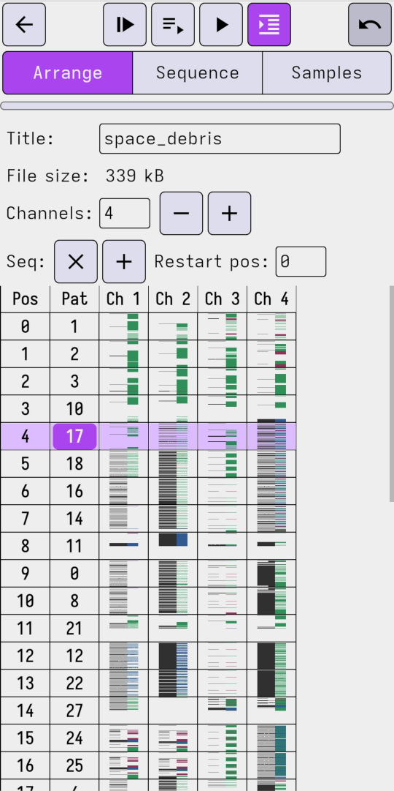
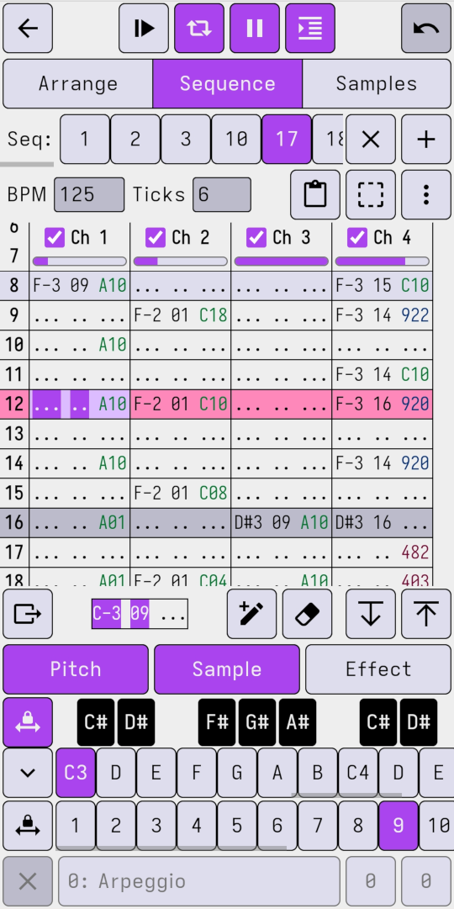
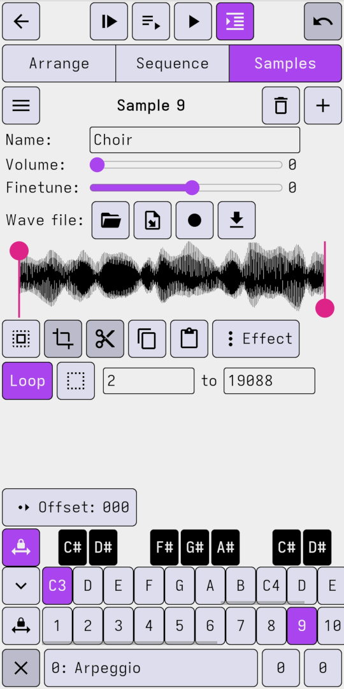

# ChromaTracker

ChromaTracker is an (unfinshed) web-based [MOD](https://en.wikipedia.org/wiki/MOD_(file_format)) music [tracker](https://en.wikipedia.org/wiki/Music_tracker), designed especially for phones and tablets.

The design is primarily inspired by Alexander Zolotov's apps [SunVox](https://www.warmplace.ru/soft/sunvox/) and [PixiTracker](https://www.warmplace.ru/soft/pixitracker/), as well as [MilkyTracker](https://milkytracker.org/) and others.

  

Features:

- Supports mobile browsers and PWA installation
  - Interface fits comfortably on a phone screen in portrait orientation
- Custom MOD playback engine using Web Audio
  - Supports MOD extensions like extra channels, panning effects, and expanded frequency limits
  - Supports almost all effects (only `E0x` and `EFx` are not supported)
- Pattern editor with touch keyboard, built-in effect documentation, cut/copy/paste
- Sample editor with basic audio effects, 8-bit dithering, recording
- Bird's-eye sequence overview (inspired by Renoise's Pattern Matrix)
- Full undo support
- Persistent local file storage, import/export MOD/sample files
- Render to WAV
- A/V sync accounting for high-latency connections (e.g. Bluetooth)

You can try the current alpha build at [tracker.chroma.zone](https://tracker.chroma.zone/). On mobile devices it works best when it's installed as a [PWA](https://www.installpwa.com/from/tracker.chroma.zone).

**Warning:** ChromaTracker is still in development; there will be bugs. Playback accuracy may be improved in the future, so your modules might not sound the same. Make backups!

## Development

See [Development.md](docs/Development.md).
